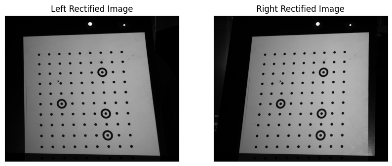
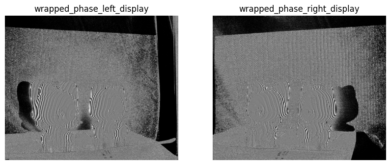
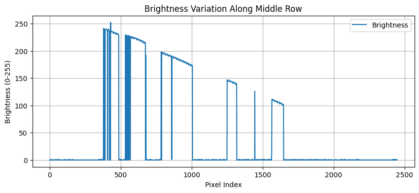
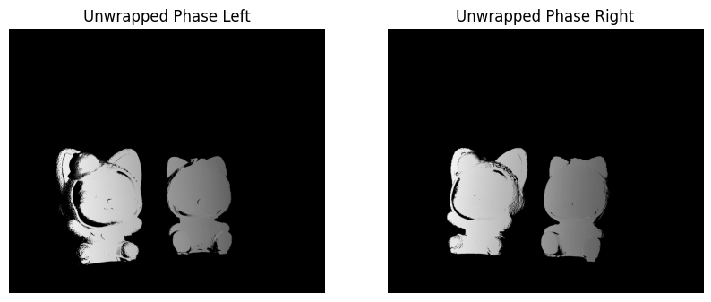
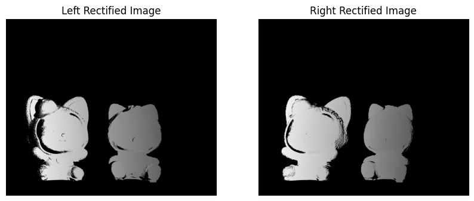
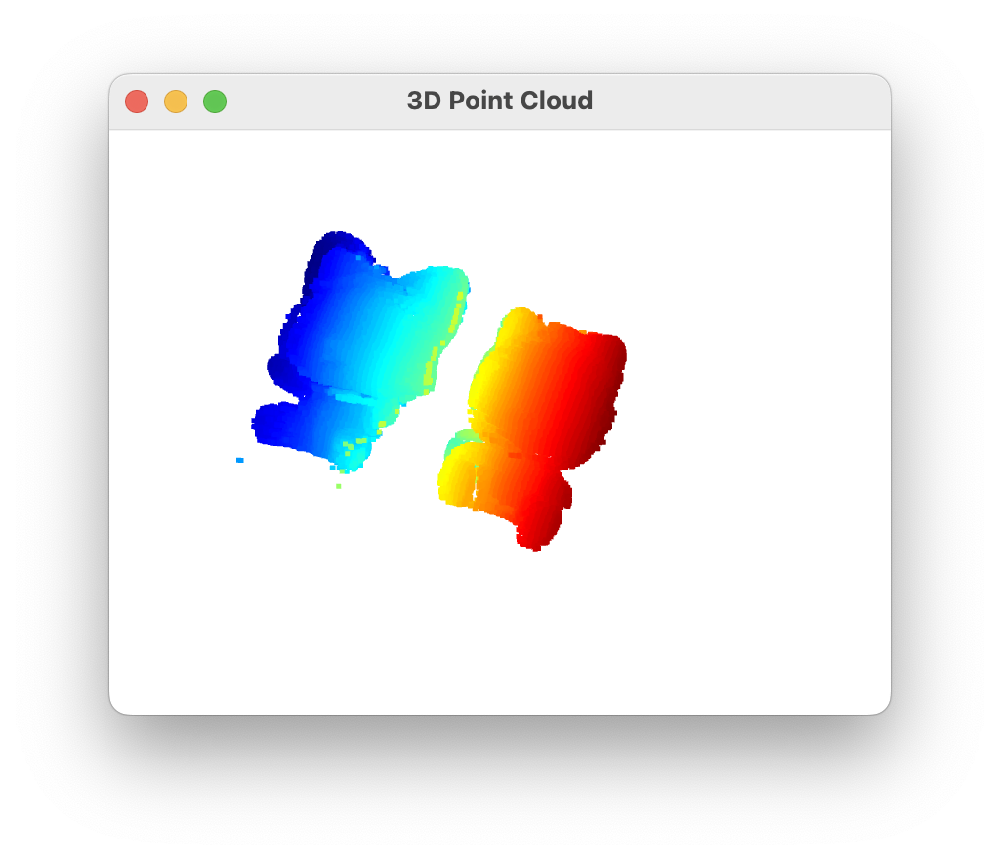

文件使用： 
 
phase文件夹：  
cam0_2_{i}.bmp，i=0,1,2,...,11，表示左相机12步相移法投射的12幅相移图像。  
cam1_2_{i}.bmp，i=0,1,2,...,11，表示右相机12步相移法投射的12幅相移图像。  
cam0_2_21.bmp，cam0_2_22.bmp，cam1_2_21.bmp，cam1_2_22.bmp，表示左相机和右相机的黑白辅助图像。  
cam0_2_12.bmp，cam1_2_12.bmp，表示左相机和右相机的互补格雷码图像。  
cam0_2_{i}.bmp，cam1_2_{i}.bmp，i=12,13,14,...,20，表示左相机和右相机的格雷码图像。

calib文件夹：  
cam0_{i}.bmp，cam1_{i}.bmp，i=0,1,2,...,9，表示左相机和右相机的标定板图像，主要用于在matlab中标定获得相机参数。

# TODO 1: 双目标定

这一步的相机参数可以由matlab算出，这里直接根据项目给出。 
输入mtx_left、dist_left、mtx_right、dist_right、om、R、T相机内外参。  
内参主要是焦距、主点、畸变，外参是两个相机的相对位置表示，如平移旋转。 
根据相机内外参数，计算极线校正后的映射（也就是原来的畸形的图像转化为正确的图像，坐标如何变换）。我们读取一对双目图像验证计算得到的映射是否正确，如果正确，会发现3d物体的同一个位置在左右图像中对应的2d像素点所形成极线是同一条直线。    
 
# TODO 2: 解展开相位
根据相移法和互补格雷码法解出展开相位，并对相位图进行极线矫正。
## 相移法得到包裹相位wrapped phase
在实际操作中，一般通过投影仪投射并采集变形条纹，再使用双目相机拍摄。  
常见的4步相移法中，每一步投射相位彼此相差 90∘ 的条纹图案，生成不同的条纹图像。通过这几幅相移图像，可以计算出每个像素的相位值。  
本项目使用12步相移法，每一步投射相位彼此相差 30∘ 的条纹图案。  
### 4步相移法公式：
φ(x, y) = arctan((I_4 - I_2) / (I_1 - I_3))  
其中，I_1, I_2, I_3, I_4分别表示在不同相移下采集的图像灰度值，φ(x, y)为相位值。
### 12步相移法公式：
A = (2 / 12) * Σ[k=0 to 11] I_k * cos(2πk / 12)  
B = (2 / 12) * Σ[k=0 to 11] I_k * sin(2πk / 12)  
φ(x, y) = arctan(B / A)  
其中，I_k表示第k幅图像的灰度值，φ(x, y)为相位值。
## 格雷码解码
这一步是为了得到unwrapped phase。  
在三维重建中，格雷码用于对物体的图像进行区域划分，并将不同的区域标记为不同的编码值。在本实验中，格雷码与相移条纹结合，将图像分割为多个子区域，再利用相位展开技术计算绝对相位。  
本项目中格雷码的解码过程包括以下几个步骤：
1. 从格雷码图像中解出 k1 值，并将其转换为二进制数。
2. 使用黑白辅助图像来确定格雷码的动态二值化阈值。
3. 根据互补格雷码 (GC9) 计算 k2。
4. 利用格雷码、互补格雷码和黑白辅助图像进行相位展开。
## 极线校正
这一步是为了将相位图矫正到极线对齐。  
极线校正后的相位图可以用于计算视差图，进而得到三维点云。     
   
  
   

# TODO 3: 3d重建
双目匹配，进行3D点云重建。  
主要原理是：对于3d物体同一位置，它在左右相机中对应着一对2d像素点，这对像素点理论上具有相同的绝对相位值，并且落在极线上。

